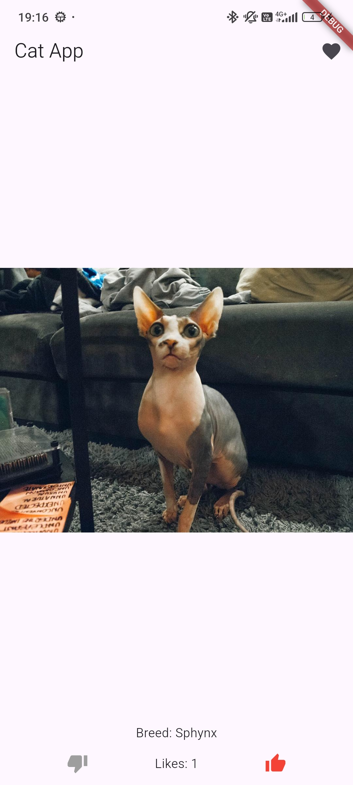
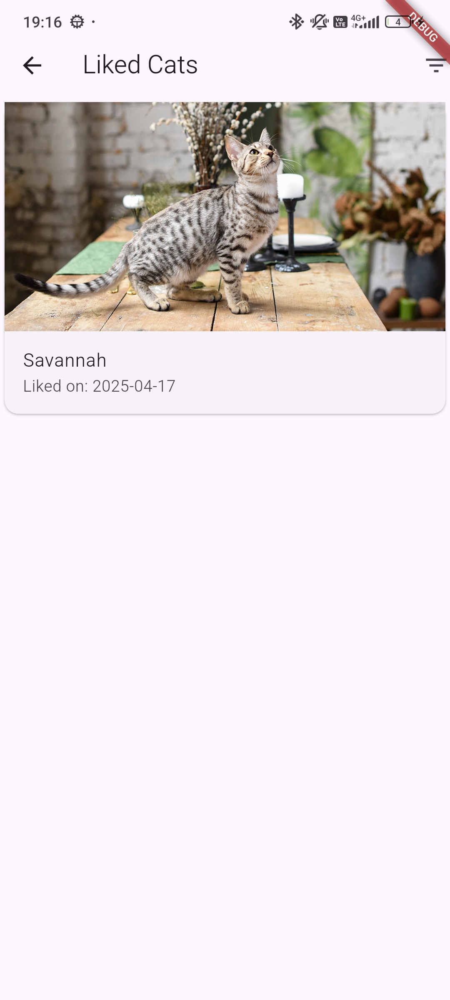

# Cat App 🐱

A Flutter application that displays random cat images with breed information, allows swiping to like/dislike, and maintains a list of favorite cats.

 

## Features ✨

- **Swipe to Like/Dislike**: Swipe right to like or left to dislike cats
- **Liked Cats Collection**: View all your liked cats in one place
- **Breed Information**: See details about each cat's breed
- **Filtering**: Filter liked cats by breed
- **Responsive Design**: Works on both mobile and tablet devices
- **Error Handling**: Graceful handling of network errors
- **Image Caching**: Smooth image loading with caching

## Technical Details 🛠️

### Architecture
- Clean Architecture with clear separation of:
  - **Data Layer**: API calls and data sources
  - **Domain Layer**: Business logic and entities
  - **Presentation Layer**: UI and state management

### State Management
- Uses **BLoC pattern** for predictable state management
- Separate BLoCs for:
  - Main cat display (`CatBloc`)
  - Liked cats collection (`LikedCatsBloc`)

### Dependencies
- **flutter_bloc**: State management
- **cached_network_image**: Image loading and caching
- **get_it**: Dependency injection
- **http**: Network requests
- **equatable**: Value equality for state objects

## Installation ⚙️

1. Clone the repository:
   ```bash
   git clone https://github.com/IgorShishkin12/flutter_sem3_hw1.git
   cd cat-app
   ```

2. Install dependencies:
   ```bash
   flutter pub get
   ```

3. Run the app:
   ```bash
   flutter run
   ```

## Building APK 🏗️

To build a release APK:
```bash
flutter build apk --release
```

[Download Latest APK](https://github.com/IgorShishkin12/flutter_sem3_hw1/blob/master/build/app/outputs/flutter-apk/app-release.apk)

## Project Structure 📂

```
lib/
├── data/
│   ├── datasources/       # Remote data sources
│   └── repositories/      # Repository implementations
├── domain/
│   ├── entities/          # Business objects
│   ├── repositories/      # Repository interfaces
│   └── usecases/          # Business logic
├── presentation/
│   ├── bloc/              # State management
│   ├── pages/             # Screen widgets
│   └── widgets/           # Reusable components
├── di/                    # Dependency injection
└── main.dart              # App entry point
```

## License 📄

This project is not licensed.
```